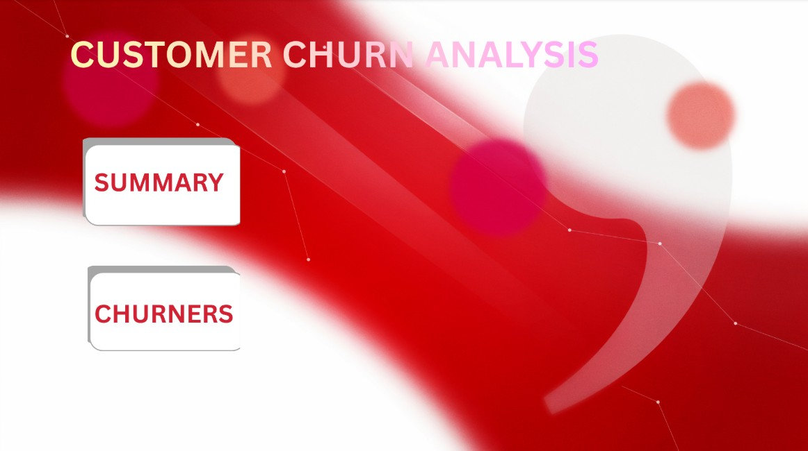

# Customer Churn Analysis Dashboard

## Project Overview

This project analyzes customer churn data to identify key factors that influence customer retention and customer attrition.

The analysis was performed using Python, SQL, and Power BI. Exploratory Data Analysis (EDA) was conducted in Google Colab, followed by the creation of an interactive dashboard in Power BI.

---

## Business Problem

Customer churn is a major challenge for businesses because acquiring new customers is often more expensive than retaining existing ones.

The goal of this project is to:

- Identify churn patterns
- Understand customer behavior
- Discover factors contributing to customer attrition
- Provide actionable insights for improving retention

---

## Tools & Technologies

- Python
- Pandas
- SQL
- Matplotlib
- Google Colab
- Power BI
- GitHub

---

## Dataset

The dataset contains customer information including:

- Customer demographics
- Contract information
- Monthly charges
- Tenure
- Service subscriptions
- Churn status

Dataset File:

`data/Customer-Churn.csv`

---

## Exploratory Data Analysis (EDA)

EDA was performed using Python and SQL in Google Colab.

Key analysis included:

- Missing value checks
- Customer distribution analysis
- Churn distribution analysis
- Numerical feature exploration
- Correlation analysis
- Customer segmentation

Notebook:

`notebooks/Churn_Analysis_EDA.ipynb`

---

## Power BI Dashboard

The dashboard provides insights into:

- Total customers
- Churned customers
- Churn rate
- Customer demographics
- Contract-wise churn
- Service-wise churn
- Revenue-related metrics

Power BI File:

`powerbi/Customer churn analysis dashboard.pbix`

---

## Dashboard Screenshots

### Dashboard Overview



### Churn Analysis (Yes)

.png.jpg)

### Churn Analysis (No)

.png.jpg)

---

## Project Structure

```text
customer-churn-analysis
│
├── data
│   └── Customer-Churn.csv
│
├── notebooks
│   └── Churn_Analysis_EDA.ipynb
│
├── powerbi
│   └── Customer churn analysis dashboard.pbix
│
├── screenshots
│   ├── dashboard_overview.png.jpg
│   ├── churn_analysis (yes).png.jpg
│   └── churn_analysis (no).png.jpg
│
└── README.md
```

---

## Skills Demonstrated

- Data Cleaning
- SQL Analysis
- Exploratory Data Analysis
- Data Visualization
- Dashboard Development
- Business Intelligence
- Data Storytelling

---

## Author

Akash S P

Data Analytics Project Portfolio
